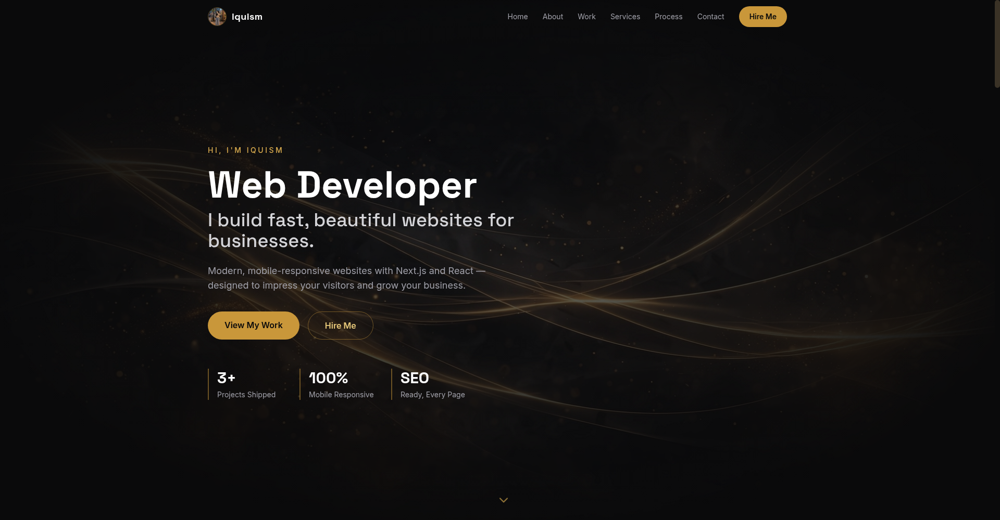

  <h1>iquism — Web Developer Portfolio</h1>
  
<b>Personal developer portfolio — projects, services, work process &amp; contact.</b>

  

    
    
    
    
  

 

  

 

<h2>About</h2>

A sleek single-page portfolio — hero, about, project showcase, services, work process, testimonials, and contact form.

<h2>Sections</h2>

<ul>
  <li><b>Hero</b> — intro with stats</li>
  <li><b>About</b> — bio &amp; skills</li>
  <li><b>Projects</b> — featured work showcase</li>
  <li><b>Services</b> — what I offer</li>
  <li><b>Process</b> — how I work</li>
  <li><b>Testimonials</b> — client feedback</li>
  <li><b>Contact</b> — get in touch</li>
</ul>

<h2>Tech Stack</h2>

Next.js 14 · React · TypeScript · Tailwind CSS · Vercel

<h2>Developed by</h2>

<b>iquism</b> — <a href="https://github.com/iquism">https://github.com/iquism</a>

